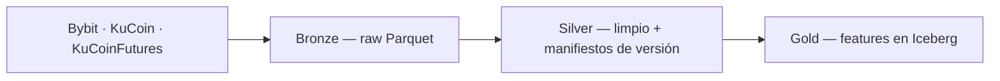
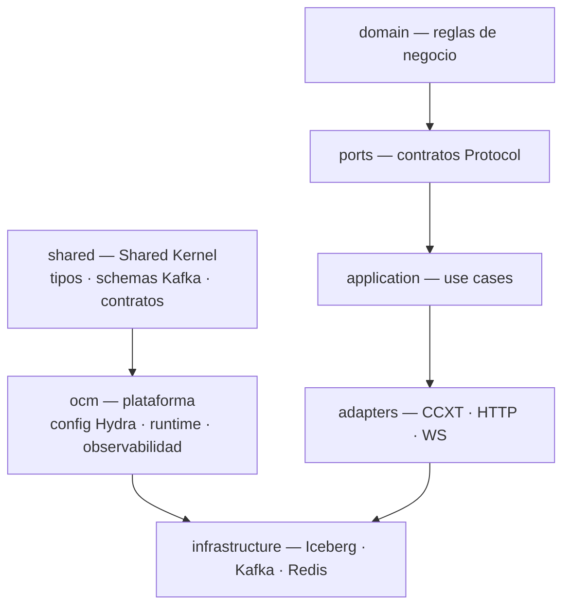
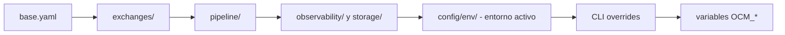

# OrangeCashMachine 🟠

Data lakehouse para datos de mercado de criptoactivos. Ingestiona datos de múltiples
exchanges, los procesa en una arquitectura **medallion** (Bronze → Silver → Gold) sobre
**Apache Iceberg** y expone capas de datos limpias y reproducibles con *time-travel*.

Arquitectura Clean/Hexagonal por **bounded contexts**, contratos de frontera verificados
estáticamente por `import-linter` en cada CI, configuración por **Hydra** y observabilidad
con **Prometheus / Grafana / Loki**.

[](https://www.python.org/)
[](https://hydra.cc/)
[](https://github.com/ccxt/ccxt)
[](pyproject.toml)

---

## ¿Qué es OrangeCashMachine?

OrangeCashMachine es un **pipeline profesional de datos de mercado cripto** que convierte
raw feeds de exchanges en un warehouse analítico reproducible:



| Capa    | Contenido                                                       |
|---------|-----------------------------------------------------------------|
| Bronze  | Datos crudos por exchange, con retención y reingestión           |
| Silver  | Datos limpios, normalizados, con manifiestos de versión          |
| Gold    | Features procesadas listas para análisis, con *time-travel*      |

Cada escritura registra **lineage** (`git_hash`, `written_at`) para reproducibilidad.

## ¿Qué problema resuelve?

Construir datasets históricos de cripto confiables es costoso: cada exchange tiene
comportamientos distintos, faltan datos, y los snapshots cambian sin aviso. Este proyecto
centraliza esa complejidad en un solo lugar:

- **Ingestión multi-exchange** con adaptadores que encapsulan las particularidades de cada
  API (paginación, límites, campos).
- **Backfill incremental + reparación de gaps** — el pipeline detecta y rellena huecos en
  Bronze/Silver automáticamente.
- **Data lakehouse sobre Iceberg** — datos versionados con *time-travel*, sin lock-in de un
  formato propietario.
- **Calidad y observabilidad** — verificaciones de calidad post-escritura y métricas
  Prometheus de extremo a extremo.
- **Contratos de arquitectura verificados** — las fronteras entre módulos se rompen en CI,
  no en review.

## Características principales

| Área              | Detalle                                                                   |
|-------------------|---------------------------------------------------------------------------|
| Exchanges         | Bybit, KuCoin, KuCoinFutures (extensible vía adaptadores CCXT)            |
| Pipeline          | Backfill histórico, incremental en tiempo real, repair de gaps            |
| Storage           | Bronze/Silver en Parquet, Gold en Iceberg con *time-travel*               |
| Mensajería        | Kafka como bus neutral (wire schemas en `shared/kafka/schemas/`)          |
| Estado            | Redis para cursores y estado compartido                                   |
| Calidad           | Invariants de dominio, cross-exchange validation, Great Expectations      |
| Observabilidad    | Prometheus, Grafana, Loki, Pushgateway, Alertmanager                      |
| Trading           | Motor paper y live sobre los mismos datos (⚠️ en desarrollo)              |
| Portfolio         | Gestión de posiciones y rebalanceo (⚠️ en desarrollo)                     |

---

## Arquitectura

El sistema se organiza en **bounded contexts** con dependencias unidireccionales y
verificadas estáticamente. El dominio no conoce a nadie de su alrededor:



| Bounded context    | Responsabilidad                                                        |
|--------------------|------------------------------------------------------------------------|
| `shared`           | Shared Kernel: tipos canónicos, schemas Kafka (ACL), eventos, contratos|
| `ocm`              | Plataforma transversal: config, runtime, observabilidad. Sin negocio   |
| `packages/market_data` | Datos de mercado: ingestión, medallion, calidad (el más maduro)     |
| `packages/trading` | Motor de trading paper + live ⚠️ **en desarrollo**                     |
| `packages/portfolio` | Posiciones y rebalanceo ⚠️ **en desarrollo**                         |
| `apps`             | Entrypoints: CLI (`app`), API gateway (`api`, experimental), `research`|
| `infrastructure`   | Adaptadores compartidos (Redis)                                        |

Las fronteras entre módulos están protegidas por **contratos import-linter** que se
ejecutan como gate del CI — una violación rompe el pipeline antes de llegar a review.
La lista completa vive en [`architecture/importlinter.toml`](architecture/importlinter.toml).

El ensamblaje de dependencias ocurre en **Composition Roots** (uno por bounded context),
por ejemplo `packages/market_data/infrastructure/bootstrap/` y
`packages/portfolio/bootstrap/`.

> Detalles por bounded context: [`docs/DOMAIN.md`](docs/DOMAIN.md).

---

## Organización del repositorio

| Directorio             | Rol                                                                 |
|------------------------|---------------------------------------------------------------------|
| `packages/market_data/`| Bounded context de datos de mercado (estable)                       |
| `packages/trading/`    | Motor de trading ⚠️ en desarrollo                                   |
| `packages/portfolio/`  | Posiciones y rebalanceo ⚠️ en desarrollo                            |
| `shared/`              | Shared Kernel — sin dependencias internas                           |
| `ocm/`                 | Plataforma: config, runtime, observabilidad                         |
| `apps/`                | `app` (CLI), `api` (gateway), `research` (notebooks, read-only)     |
| `infrastructure/`      | Adaptadores de infraestructura compartida                           |
| `config/`              | Capas de configuración Hydra (YAML)                                 |
| `architecture/`        | Contratos de frontera (`importlinter.toml`)                         |
| `docs/`                | ADRs, guía de dominio, auditorías                                   |
| `tests/`               | Suites por paquete                                                  |

Entrypoints (definidos en `pyproject.toml` y `run.sh`, SSOT):

| Comando        | Descripción                                                              |
|----------------|--------------------------------------------------------------------------|
| `ocm`          | Pipeline de datos de mercado (Hydra)                                     |
| `ocm-api`      | API gateway FastAPI — ⚠️ experimental                                    |
| `paper`        | Trading en paper (modo seguro)                                           |
| `live`         | Trading en vivo — ⚠️ **capital real**                                    |

> **Entrypoints legacy vs Hydra.** Los módulos `apps/app/cli/live.py` y `paper.py`
> coexisten temporalmente con las variantes Hydra/Composition Root (`live_hydra`,
> `paper_hydra`). Los comandos `live` y `paper` ya resuelven a las variantes Hydra;
> la dirección arquitectónica es Hydra (ADR-0005) y los legacy se eliminarán al
> completar la migración.

---

## Inicio rápido

Requisitos: **Python ≥ 3.11**, **uv**, **Docker** + **Docker Compose**, **Redis 6+**.

```bash
# 1. Clonar
git clone https://github.com/OrangeCashDigital/orangecashmachine.git
cd orangecashmachine

# 2. Instalar dependencias
uv sync

# 3. Configurar entorno
cp .env.example .env
# editar .env: API keys de exchanges, OCM_STORAGE__DATA_LAKE__PATH, etc.

# 4. Levantar infraestructura local (Redis, Kafka, observabilidad)
docker compose up -d

# 5. Validar la configuración sin ejecutar nada
uv run ocm --cfg job

# 6. Ejecutar el pipeline de datos de mercado
uv run ocm
```

Para trading:

```bash
uv run paper   # paper trading — modo seguro
uv run live    # ⚠️ capital real — leer la configuración de riesgo antes
```

Todas las variables de entorno están registradas en
[`ocm/config/env_vars.py`](ocm/config/env_vars.py) (SSOT). El separador `__` mapea a la
jerarquía del schema: `OCM_SECTION__KEY=valor` (p. ej. `OCM_STORAGE__DATA_LAKE__PATH`).

> **Seguridad:** inspeccionar la configuración con `uv run ocm --cfg job` expone secretos
> en stdout. Nunca redirigir ese output a logs en producción.

## Configuración

La configuración se compone en capas vía Hydra, con precedencia de menor a mayor:



- **Variables de entorno** — `OCM_*__` mapean al schema vía separador `__`
  (`OCM_SECTION__KEY=valor`). SSOT en `ocm/config/env_vars.py`.
- **Entornos** — `development` (dry-run, debug), `production` (credenciales requeridas),
  `test` (CI, datos aislados). `dry_run: true` es el default global en `base.yaml`.
- **Inspección segura** — `uv run ocm --cfg job` valida y muestra la config efectiva.

---

## Observabilidad

Con `docker compose up` se levanta el stack completo (puertos configurables vía
`*_HOST_PORT`):

| Servicio    | URL                   | Rol                                          |
|-------------|-----------------------|----------------------------------------------|
| Prometheus  | http://localhost:9090 | Métricas de sistema y pipeline               |
| Grafana     | http://localhost:3000 | Dashboards provisionados desde `deploy/`     |
| Loki        | http://localhost:3100 | Logs estructurados vía Promtail              |
| Pushgateway | http://localhost:9091 | Métricas push desde jobs batch               |
| Alertmanager| http://localhost:9093 | Alertas (deadman switch del pipeline)        |
| Kafka UI    | http://localhost:8080 | Inspección de tópicos Kafka                  |
| Redis       | localhost:6379        | Estado compartido, cursores (TCP)            |

Dashboards y alertas se provisionan automáticamente desde `deploy/monitoring/`.

---

## Tecnologías

| Tecnología    | Uso                                                             |
|---------------|-----------------------------------------------------------------|
| Python 3.11–3.13 | Lenguaje principal                                           |
| ccxt          | Conexión unificada a exchanges                                  |
| Apache Iceberg | Capa Gold (features) con *time-travel*                        |
| Parquet       | Capas Bronze/Silver                                             |
| Polars        | DataFrames (⚠️ reemplazando a pandas en curso)                  |
| Redis         | Cursor store, estado compartido                                 |
| Kafka         | Bus neutral de eventos (wire schemas en `shared/kafka/`)        |
| Hydra + Pydantic | Configuración en capas con validación de schema              |
| FastAPI       | API gateway — ⚠️ experimental                                   |
| Prometheus / Grafana / Loki | Métricas, dashboards y logs                      |

## Principios arquitectónicos

- **Clean/Hexagonal** — dependencias siempre hacia adentro: el dominio no conoce a nadie.
- **Bounded contexts con contratos** — las fronteras se verifican estáticamente en CI.
- **Shared Kernel** — `shared/` contiene lo común sin acoplarse a implementaciones.
- **Composition Root único por BC** — el ensamblaje de dependencias vive en un solo punto.
- **Fail-Soft** — ante errores no críticos, degradar en vez de fallar el pipeline completo.
- **SafeOps** — `dry_run: true` es el default global; producción lo sobrescribe
  explícitamente (ver `config/base.yaml`).

Estos principios están formalizados en
[`docs/architecture/0000-principios-arquitectonicos.md`](docs/architecture/0000-principios-arquitectonicos.md).

---

## Estado del proyecto

| Componente      | Estado                                                                  |
|-----------------|-------------------------------------------------------------------------|
| `market_data`   | **Estable** — pipeline medallion, Iceberg, Kafka, calidad, observabilidad|
| `trading`       | **En desarrollo** — motor paper/live activo en evolución                |
| `portfolio`     | **En desarrollo** — posiciones y rebalanceo en consolidación            |
| API gateway     | **Experimental** — FastAPI/JWT en fase inicial                          |
| pandas → polars | **En migración** — transición activa de DataFrames                      |

**Limitaciones conocidas** (se resuelven en el roadmap, no son defectos del README):

- Errores de tipado (`mypy`) pendientes de resolución durante la migración a Polars.
- El job de validación de configuración del CI aún usa una invocación desactualizada.
- El control plane de orquestación se está consolidando (evolución histórica de Prefect →
  Dagster → Docker Compose + Hydra CLIs; ver [ADR-0002](docs/architecture/0002-event-driven-kappa-architecture.md)
  y [ADR-0006](docs/architecture/0006-verificacion-adrs-vs-codigo.md)).
- Deuda arquitectónica conocida y analizada en [`docs/DOMAIN.md`](docs/DOMAIN.md) (§ 5).

---

## Documentación

| Recurso                                   | Qué encontrarás                                                        |
|-------------------------------------------|------------------------------------------------------------------------|
| [`docs/DOMAIN.md`](docs/DOMAIN.md)        | Guía por bounded context, deuda técnica, camino de evolución           |
| [`docs/architecture/`](docs/architecture/) | ADRs 0000–0006: principios, Kappa, Composition Root, Hydra             |
| [`docs/architecture/decisions/`](docs/architecture/decisions/) | ADRs 0003–0008: decisiones puntuales por BC |
| [`docs/architecture/GOVERNANCE.md`](docs/architecture/GOVERNANCE.md) | Gobernanza de la arquitectura                    |
| [`AGENTS.md`](AGENTS.md)                  | Comandos, convenciones y *gotchas* para desarrolladores                |
| [`architecture/importlinter.toml`](architecture/importlinter.toml) | Contratos de frontera verificados              |

---

## Contribución

1. Crea una rama desde `main`.
2. Commits en formato [Conventional Commits](https://www.conventionalcommits.org/).
3. Pre-commit aplica `ruff check --fix` y `ruff format` automáticamente.
4. Verifica antes del PR:

   ```bash
   uv run ruff check .
   uv run lint-imports --config architecture/importlinter.toml
   uv run pytest tests/ -q
   uv run mypy .
   uv run bandit .
   ```

5. `type: ignore` requiere un comentario explicativo.

El flujo completo de CI, convenciones y *gotchas* está en [`AGENTS.md`](AGENTS.md).

---

## Licencia

MIT — ver la declaración en [`pyproject.toml`](pyproject.toml).
