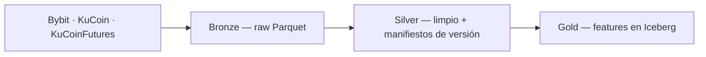
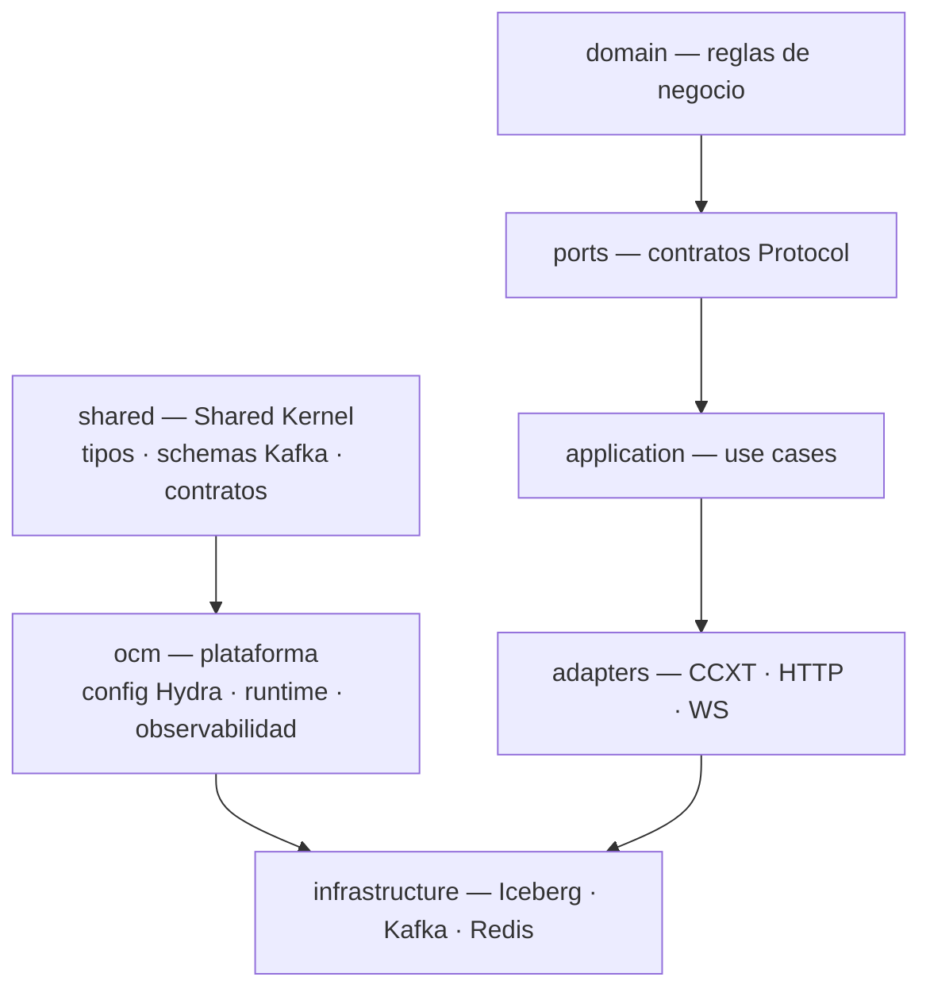
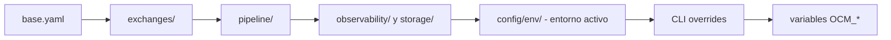

# OrangeCashMachine 🟠

Data lakehouse para datos de mercado de criptoactivos. Ingestiona datos de múltiples
exchanges, los procesa en una arquitectura **medallion** (Bronze → Silver → Gold) sobre
**Apache Iceberg** y expone capas de datos limpias y reproducibles con *time-travel*.

Arquitectura Clean/Hexagonal por **bounded contexts**, contratos de frontera verificados
estáticamente por `import-linter` en cada CI, configuración por **Hydra** y observabilidad
con **Prometheus / Grafana / Loki**.

[](https://www.python.org/)
[](https://hydra.cc/)
[](https://github.com/ccxt/ccxt)
[](pyproject.toml)

---

## ¿Qué es OrangeCashMachine?

OrangeCashMachine es un **pipeline profesional de datos de mercado cripto** que convierte
raw feeds de exchanges en un warehouse analítico reproducible:



| Capa    | Contenido                                                       |
|---------|-----------------------------------------------------------------|
| Bronze  | Datos crudos por exchange, con retención y reingestión           |
| Silver  | Datos limpios, normalizados, con manifiestos de versión          |
| Gold    | Features procesadas listas para análisis, con *time-travel*      |

Cada escritura registra **lineage** (`git_hash`, `written_at`) para reproducibilidad.

## ¿Qué problema resuelve?

Construir datasets históricos de cripto confiables es costoso: cada exchange tiene
comportamientos distintos, faltan datos y los snapshots cambian sin aviso. OrangeCashMachine
centraliza esa complejidad en un solo lugar — las capacidades se describen abajo.

## Características principales

| Área              | Detalle                                                                   |
|-------------------|---------------------------------------------------------------------------|
| Exchanges         | Bybit, KuCoin, KuCoinFutures (extensible vía adaptadores CCXT)            |
| Pipeline          | Backfill histórico, incremental en tiempo real, repair de gaps            |
| Storage           | Bronze/Silver en Parquet, Gold en Iceberg con *time-travel*               |
| Mensajería        | Kafka como bus neutral (wire schemas en `shared/kafka/schemas/`)          |
| Estado            | Redis para cursores y estado compartido                                   |
| Calidad           | Invariants de dominio, cross-exchange validation, Great Expectations      |
| Observabilidad    | Prometheus, Grafana, Loki, Pushgateway, Alertmanager                      |
| Trading           | Motor paper y live sobre los mismos datos (⚠️ en desarrollo)              |
| Portfolio         | Gestión de posiciones y rebalanceo (⚠️ en desarrollo)                     |

---

## Arquitectura

El sistema se organiza en **bounded contexts** con dependencias unidireccionales y
verificadas estáticamente. El dominio no conoce a nadie de su alrededor:



| Bounded context    | Responsabilidad                                                        |
|--------------------|------------------------------------------------------------------------|
| `shared`           | Shared Kernel: tipos canónicos, schemas Kafka (ACL), eventos, contratos|
| `ocm`              | Plataforma transversal: config, runtime, observabilidad. Sin negocio   |
| `packages/market_data` | Datos de mercado: ingestión, medallion, calidad (el más maduro)     |
| `packages/trading` | Motor de trading paper + live ⚠️ **en desarrollo**                     |
| `packages/portfolio` | Posiciones y rebalanceo ⚠️ **en desarrollo**                         |
| `apps`             | Entrypoints: CLI (`app`), API gateway (`api`, experimental), `research`|
| `infrastructure`   | Adaptadores compartidos (Redis)                                        |

Las fronteras entre módulos están protegidas por **contratos import-linter** que se
ejecutan como gate del CI — una violación rompe el pipeline antes de llegar a review.
La lista completa vive en [`architecture/importlinter.toml`](architecture/importlinter.toml).

La calidad del Shared Kernel está gobernada por automatización (ADR-0010): contratos
BC-46/47/48, verificación de SSOT de literales (`scripts/check_ssot_enums.py`),
métricas de salud (`scripts/metrics_report.py` → `architecture/metrics.json`),
`pip-audit` (vulnerabilidades) y hooks de pre-commit (import-linter, mypy, SSOT).

El ensamblaje de dependencias ocurre en **Composition Roots** (uno por bounded context),
por ejemplo `packages/market_data/infrastructure/bootstrap/` y
`packages/portfolio/bootstrap/`.

> Detalles por bounded context: [`docs/DOMAIN.md`](docs/DOMAIN.md).

---

## Organización del repositorio

| Directorio             | Rol                                                                 |
|------------------------|---------------------------------------------------------------------|
| `packages/market_data/`| Bounded context de datos de mercado (estable)                       |
| `packages/trading/`    | Motor de trading ⚠️ en desarrollo                                   |
| `packages/portfolio/`  | Posiciones y rebalanceo ⚠️ en desarrollo                            |
| `shared/`              | Shared Kernel — sin dependencias internas                           |
| `ocm/`                 | Plataforma: config, runtime, observabilidad                         |
| `apps/`                | `app` (CLI), `api` (gateway), `research` (notebooks, read-only)     |
| `infrastructure/`      | Adaptadores de infraestructura compartida                           |
| `config/`              | Capas de configuración Hydra (YAML)                                 |
| `architecture/`        | Contratos de frontera (`importlinter.toml`)                         |
| `docs/`                | ADRs, guía de dominio, auditorías                                   |
| `tests/`               | Suites por paquete                                                  |

Entrypoints (SSOT: `[project.scripts]` en `pyproject.toml`; `run.sh` expone un subconjunto `ocm|live|paper`):

| Comando        | Descripción                                                              |
|----------------|--------------------------------------------------------------------------|
| `ocm`          | Pipeline de datos de mercado (Hydra)                                     |
| `ocm-api`      | API gateway FastAPI — ⚠️ experimental                                    |
| `paper`        | Trading en paper (modo seguro)                                           |
| `live`         | Trading en vivo — ⚠️ **capital real**                                    |

> **Entrypoints legacy vs Hydra.** `live` y `paper` resuelven a las variantes Hydra
> (`live_hydra`, `paper_hydra`); los módulos legacy `apps/app/cli/live.py` y `paper.py`
> coexisten por compatibilidad y se eliminarán al completar la migración (ADR-0005).

---

## Instalación

Requisitos: **Python ≥ 3.11**, **uv**, **Docker** + **Docker Compose**, **Redis 6+**.

```bash
# 1. Clonar
git clone https://github.com/OrangeCashDigital/orangecashmachine.git
cd orangecashmachine

# 2. Instalar dependencias (runtime)
uv sync

# 3. Configurar entorno — .env alimenta Docker Compose y las variables OCM_*
cp .env.example .env
# editar .env:
#   - GRAFANA_PASSWORD: obligatoria — sin ella, `docker compose up -d` falla
#   - API keys de exchanges (BYBIT_*, KUCOIN_*)
#   - OCM_STORAGE__DATA_LAKE__PATH: ruta del data lake
#   - OCM_ENV: development (default) o production

# 4. Levantar infraestructura local (Redis, Kafka, observabilidad)
docker compose up -d

# 5. Validar la configuración sin ejecutar nada
uv run ocm --cfg job
```

> **Seguridad:** `uv run ocm --cfg job` expone secretos en stdout. Nunca redirigir ese
> output a logs en producción.

Para desarrollo y contribución, instala también las herramientas dev
(`pytest`, `ruff`, `mypy`, `bandit`, `import-linter`, `pre-commit`):

```bash
uv sync --group dev
```

## Uso

### Pipeline de datos de mercado

```bash
uv run ocm                                            # desarrollo (dry-run por default)
uv run ocm env=production                             # entorno de producción
uv run ocm pipeline.historical.backfill_mode=true     # backfill histórico
uv run ocm --cfg job                                  # imprimir config efectiva (⚠️ secretos)
OCM_VALIDATE_ONLY=true uv run python -m app.cli.main  # validar config y salir sin ejecutar
```

Alternativa equivalente vía [`run.sh`](run.sh): `./run.sh ocm [args...]`.

### Trading en paper

```bash
uv run paper --symbol BTC/USDT --timeframe 1h --fast 9 --slow 21 --market-type spot
```

> El capital en paper sale de `config.portfolio.capital_usd` (no hay flag `--capital`).
> Ver más opciones con `uv run paper --help`.

### Trading en vivo — ⚠️ **capital real**

```bash
uv run live --capital 10000 --symbol BTC/USDT --timeframe 1h \
  --strategy ema_crossover --fast 9 --slow 21
```

> **SafeOps:** `live` exige `--capital` explícito (sin default). Revisa la configuración
> de riesgo en `config/risk/` antes de ejecutar.

### API gateway — ⚠️ experimental

```bash
uv run ocm-api
```

### Tests

```bash
uv run pytest tests/ -q -m "not integration"   # unit tests (sin infraestructura)
uv run pytest tests/ -q -m integration         # integración — requiere Kafka en :9093
uv run pytest tests/ -q                        # suite completa (incluye integración)
```

## Configuración

La configuración se compone en capas vía Hydra, con precedencia de menor a mayor:



- **Variables de entorno** — `OCM_*__` mapean al schema vía separador `__`
  (`OCM_SECTION__KEY=valor`); SSOT en `ocm/config/env_vars.py`.
- **Entornos** — `development` (dry-run, debug), `production` (credenciales requeridas),
  `test` (CI, datos aislados). `dry_run: true` es el default global en `base.yaml`.

---

## Observabilidad

El stack se levanta con Docker Compose (puertos configurables vía `*_HOST_PORT`):

| Servicio    | URL                   | Rol                                          |
|-------------|-----------------------|----------------------------------------------|
| Prometheus  | http://localhost:9090 | Métricas de sistema y pipeline               |
| Grafana     | http://localhost:3000 | Dashboards provisionados desde `deploy/`     |
| Loki        | http://localhost:3100 | Logs estructurados vía Promtail              |
| Pushgateway | http://localhost:9091 | Métricas push desde jobs batch               |
| Alertmanager| http://localhost:9093 | Alertas (deadman switch del pipeline)        |
| Kafka UI    | http://localhost:8080 | Inspección de tópicos Kafka                  |
| Redis       | localhost:6379        | Estado compartido, cursores (TCP)            |

Dashboards y alertas se provisionan automáticamente desde `deploy/monitoring/`.

---

## Tecnologías

| Tecnología    | Uso                                                             |
|---------------|-----------------------------------------------------------------|
| Python 3.11–3.13 | Lenguaje principal                                           |
| ccxt          | Conexión unificada a exchanges                                  |
| Apache Iceberg | Capa Gold (features) con *time-travel*                        |
| Parquet       | Capas Bronze/Silver                                             |
| Polars        | DataFrames (⚠️ reemplazando a pandas en curso)                  |
| Redis         | Cursor store, estado compartido                                 |
| Kafka         | Bus neutral de eventos (wire schemas en `shared/kafka/`)        |
| Hydra + Pydantic | Configuración en capas con validación de schema              |
| FastAPI       | API gateway — ⚠️ experimental                                   |

## Principios arquitectónicos

- **Clean/Hexagonal** — dependencias siempre hacia adentro: el dominio no conoce a nadie.
- **Bounded contexts con contratos** — las fronteras se verifican estáticamente en CI.
- **Shared Kernel** — `shared/` contiene lo común sin acoplarse a implementaciones.
- **Composition Root único por BC** — el ensamblaje de dependencias vive en un solo punto.
- **Fail-Soft** — ante errores no críticos, degradar en vez de fallar el pipeline completo.
- **SafeOps** — `dry_run: true` es el default global; producción lo sobrescribe
  explícitamente (ver `config/base.yaml`).

Estos principios están formalizados en
[`docs/architecture/0000-principios-arquitectonicos.md`](docs/architecture/0000-principios-arquitectonicos.md).

---

## Estado del proyecto

| Componente      | Estado                                                                  |
|-----------------|-------------------------------------------------------------------------|
| `market_data`   | **Estable** — pipeline medallion, Iceberg, Kafka, calidad, observabilidad|
| `trading`       | **En desarrollo** — motor paper/live activo en evolución                |
| `portfolio`     | **En desarrollo** — posiciones y rebalanceo en consolidación            |
| API gateway     | **Experimental** — FastAPI/JWT en fase inicial                          |
| pandas → polars | **En migración** — transición activa de DataFrames                      |

**Limitaciones conocidas** (se resuelven en el roadmap, no son defectos del README):

- Errores de tipado (`mypy`) pendientes de resolución durante la migración a Polars.
- El control plane de orquestación sigue consolidándose (Docker Compose + Hydra CLIs;
  ver [ADR-0002](docs/architecture/0002-event-driven-kappa-architecture.md) y
  [ADR-0006](docs/architecture/0006-verificacion-adrs-vs-codigo.md)).
- Deuda arquitectónica conocida y analizada en [`docs/DOMAIN.md`](docs/DOMAIN.md) (§ 5).

---

## Documentación

| Recurso                                   | Qué encontrarás                                                        |
|-------------------------------------------|------------------------------------------------------------------------|
| [`docs/DOMAIN.md`](docs/DOMAIN.md)        | Guía por bounded context, deuda técnica, camino de evolución           |
| [`docs/architecture/`](docs/architecture/) | ADRs 0000–0006: principios, Kappa, Composition Root, Hydra             |
| [`docs/architecture/decisions/`](docs/architecture/decisions/) | ADRs 0003–0009: decisiones puntuales por BC |
| [`docs/architecture/GOVERNANCE.md`](docs/architecture/GOVERNANCE.md) | Gobernanza de la arquitectura                    |
| [`AGENTS.md`](AGENTS.md)                  | Comandos, convenciones y *gotchas* para desarrolladores                |
| [`architecture/importlinter.toml`](architecture/importlinter.toml) | Contratos de frontera verificados              |

---

## Contribución

1. Instala las herramientas dev y los hooks de pre-commit:

   ```bash
   uv sync --group dev
   pre-commit install
   ```

2. Trabaja sobre `main` con commits atómicos en formato
   [Conventional Commits](https://www.conventionalcommits.org/).
3. Los hooks de pre-commit aplican `ruff check --fix` y `ruff format` automáticamente;
   `readme-size-guard` bloquea la pérdida masiva de contenido en `README.md`.
   Si un hook modifica archivos: `git add -u && git commit` — nunca saltear hooks.
4. Verifica antes del push:

   ```bash
   uv run ruff check .
   uv run lint-imports --config architecture/importlinter.toml
   uv run pytest tests/ -q -m "not integration"
   uv run mypy .
   uv run bandit .
   ```

5. `type: ignore` requiere un comentario explicativo.
6. Los tests de integración (`-m integration`) requieren infraestructura real (Kafka);
   en CI corren en un job separado con Kafka como *service container*.

El flujo completo de CI, convenciones y *gotchas* está en [`AGENTS.md`](AGENTS.md).

---

## Licencia

MIT — ver la declaración en [`pyproject.toml`](pyproject.toml).
